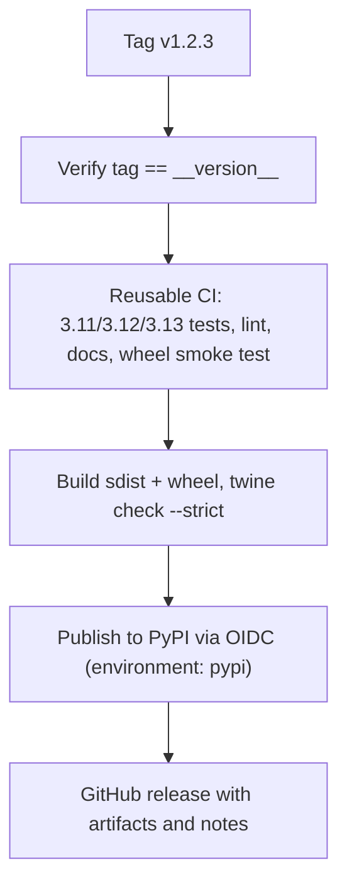

# Releasing

Publishing is driven entirely by a tag. Pushing `v1.2.3` verifies, tests, builds,
uploads to PyPI and creates a GitHub release; nothing is published by hand.

## One-time setup

These steps have to be done once, by someone with admin access to the repository
and the PyPI project. Until they are done, a tag will fail at the publish step.

1. **Reserve the name on PyPI.** `genai-opt` was unclaimed at the time of
   writing. Create the project, or upload the first release manually to claim it.
2. **Register the Trusted Publisher.** On PyPI, under the project's *Publishing*
   settings, add a GitHub publisher with:
   - Owner: `Wojciech151218`
   - Repository: `genai-opt`
   - Workflow: `release.yml`
   - Environment: `pypi`
3. **Create the `pypi` GitHub environment.** Repository *Settings → Environments*.
   Adding required reviewers here is worth considering: it turns every upload into
   something a human approves, and PyPI uploads cannot be undone.

No API token is needed, and none should be added. Authentication is
[Trusted Publishing](https://docs.pypi.org/trusted-publishers/): PyPI verifies the
workflow's OIDC identity at upload time, so there is no long-lived credential to
leak or rotate.

## Cutting a release

1. Make sure `main` is green and the changelog has an entry for the version.
2. Bump `__version__` in `src/genai_opt/__init__.py`. That is the only place a
   version is written — the distribution metadata is derived from it, so the tag,
   the wheel and `genai_opt.__version__` cannot disagree.
3. Merge the bump.
4. Tag the merge commit and push it:

```bash
git tag v1.2.3
git push origin v1.2.3
```

Only tags matching `v<major>.<minor>.<patch>` start the pipeline. A typo like
`v1.2` or a pre-release tag like `v1.2.3-rc1` is ignored on purpose.

## What the pipeline does



Each stage exists to stop a specific failure:

- **Verify** catches a tag created on the wrong commit, or before the version bump
  landed. Without it a `v1.0.0` tag could ship a wheel whose metadata says
  `0.1.0`.
- **CI** is the same reusable workflow that guards pull requests, called rather
  than copied, so a release can never be held to a weaker standard than a PR. It
  includes installing the built wheel into a clean environment and running a real
  experiment through it.
- **Build** re-checks that the artifact filenames carry the tagged version, which
  closes the loop from the other direction.
- **Publish** uploads to PyPI. This is the irreversible step, and the only one
  that touches a protected environment.
- **Release** comes last on purpose: a GitHub release announcing a version nobody
  can `pip install` is worse than no release at all.

## If something goes wrong

A failure before the publish step is safe to fix and retag. Delete the tag
locally and remotely, fix the problem, and tag again.

After a successful upload, the version is permanent: PyPI does not allow
re-uploading a version, even if you delete it. Release the fix as a new patch
version instead.
